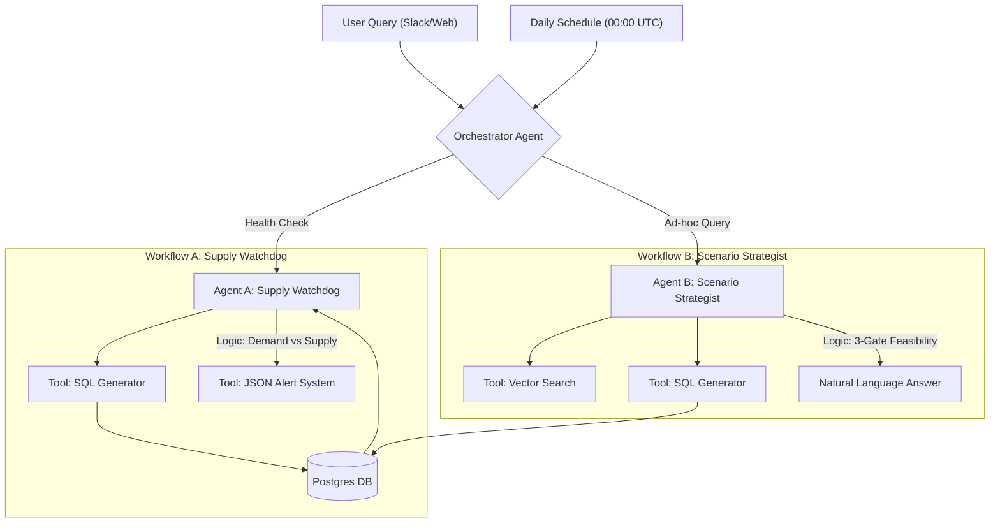

## Clinical Supply Chain Control Tower: Agentic AI Architecture

### 1. Executive Summary

**Global Pharma Inc.** faces critical risks in stock-outs and inventory waste due to fragmented data across 40+ tables. This solution implements an **Autonomous Agentic System** to mitigate these risks.

We utilize a **Hub-and-Spoke Multi-Agent Architecture** built on **LangGraph** and **Anthropic Claude**. This ensures separation of concerns, allowing specialized agents to handle high-volume monitoring (**The Watchdog**) and complex decision support (**The Strategist**) without context window overflow, while remaining production-ready for Postgres and n8n orchestration.

---

### 2. Architectural Design (Part 1)

#### 2.1 High-Level Architecture

The system is orchestrated by a central router that directs tasks based on the trigger source (Cron vs. User).



#### 2.2 Agent Definitions

| Agent Name       | Role              | Trigger      | Tables Owned (Schema Context)                                                                 |
|------------------|-------------------|--------------|------------------------------------------------------------------------------------------------|
| Orchestrator     | Intent Routing    | User / Cron  | None (Routing only)                                                                            |
| Supply Watchdog  | Risk Monitoring   | Scheduled    | `available_inventory_report`, `study_level_enrollment_report`, `lot_status_report`            |
| Scenario Strategist | Decision Support | User Query | `re_evaluation`, `rim`, `ip_shipping_timelines_report`                                        |

---

### 3. Technical Implementation Strategy (Part 2)

#### 3.1 SQL Logic: Shortfall Prediction

To detect stock-outs 8 weeks in advance, we join **Supply (Inventory)** with **Demand (Enrollment Rate)**.

The core SQL query:

```sql
WITH Trial_Supply AS (
    -- Aggregate total inventory per trial from 'available_inventory_report'
    SELECT 
        "Trial Name" as trial_id, 
        SUM("Quantity Available") as total_stock
    FROM available_inventory_report
    GROUP BY "Trial Name"
),
Trial_Demand AS (
    -- Get monthly burn rate from 'study_level_enrollment_report'
    SELECT 
        "trial_alias" as trial_id,
        "enrollment_rate_monthly_actual" as monthly_burn_rate
    FROM study_level_enrollment_report
)
SELECT 
    S.trial_id,
    S.total_stock,
    D.monthly_burn_rate,
    -- Formula: Stock / (Monthly Rate / 4 weeks) = Weeks of Coverage
    (S.total_stock / NULLIF((D.monthly_burn_rate / 4), 0)) as weeks_of_coverage
FROM Trial_Supply S
JOIN Trial_Demand D ON S.trial_id = D.trial_id
-- Filter: Alert if coverage is less than 8 weeks
WHERE (S.total_stock / NULLIF((D.monthly_burn_rate / 4), 0)) < 8;
```

This is invoked by the **Supply Watchdog** agent via the self-healing SQL tool.

#### 3.2 Tool Design (Self-Healing SQL & Vector Search)

- **Self-Healing SQL Tool (`run_sql_query`)**
  - Executes SQL against the **PostgreSQL** instance via a shared `DatabaseManager`.
  - Catches database errors (e.g., `column "qty" does not exist`) and returns the full error message (and any Postgres hint) back to the LLM.
  - The agent (or external workflow like n8n) can then regenerate a corrected query (e.g., using `"Quantity Available"` instead of a hallucinated `qty` column).

- **Vector Search Tool (`search_trial_by_name`)**
  - Uses **ChromaDB** and sentence-transformer embeddings to perform semantic search over trial names and descriptions.
  - Resolves fuzzy user inputs like "The Diabetes Trial" to canonical IDs like `CT-2004-PSX`.
  - The Strategist always uses this before issuing trial-specific SQL.

#### 3.3 System Prompt Design: Supply Watchdog Agent

**Assignment Context:** The production implementation uses pre-compiled SQL for efficiency, but the BRD explicitly asks for the **system prompt** that would drive LLM-based SQL generation for the Supply Watchdog. Below is the prompt, along with the schema-isolation strategy.

**System Prompt (Supply Watchdog):**

```
You are the Supply Watchdog Agent. Your mission: Detect supply chain risks BEFORE they become critical.

YOUR TASKS:
1. Expiry Risk Detection
2. Shortfall Prediction

SCHEMA CONTEXT (Use ONLY these tables):

Table: available_inventory_report
- "Trial Name" (text): Study identifier
- "Quantity Available" (int): Current stock
- "Expiry Date" (date): Batch expiration

Table: study_level_enrollment_report
- "trial_alias" (text): Study identifier (joins with "Trial Name")
- "enrollment_rate_monthly_actual" (float): Patients per month

Table: lot_status_report
- "Lot Number" (text): Batch identifier
- "Expiration Date" (date): When batch expires
- "Trial Alias" (text): Associated trial

RULES:
- Use exact column names in quotes (case-sensitive).
- For Shortfall: calculate weeks_coverage = total_stock / (monthly_rate / 4).
- Alert if weeks_coverage < 8.
- For Expiry: flag batches expiring within 90 days and classify as:
  - Critical (<30 days), High (30–60 days), Medium (60–90 days).
- NEVER assume columns exist – use only the schema above.

OUTPUT:
- Return only the SQL query (no natural language, no markdown).
```

**Schema Isolation Strategy:**

- **Agent specialization:** Each agent only sees 3–5 relevant tables in its system prompt.
- **Schema pruning:** Prompts include only the exact columns needed for that agent’s tasks.
- **Pre-validation:** The `run_sql_query` tool validates and surfaces errors; the LLM is then asked to regenerate SQL using the returned error and schema reminder, enabling a self-healing loop.

---

### 4. Edge Case Handling (Part 3)

#### 4.1 Data Ambiguity (Fuzzy Matching)

- **Scenario:** User asks for "The Diabetes Trial", but the database uses ID `CT-2004-PSX`.
- **Solution:** Use the `search_trial_by_name` tool:
  - Embed the user query and search a vector index of trial aliases and descriptions (mocked via a mapping in this assignment).
  - Retrieve the trial ID (`CT-2004-PSX`) and inject it into all subsequent SQL queries.

#### 4.2 Invalid SQL Generation

- **Scenario:** The agent hallucinates a column name.
- **Solution:** Self-Healing Loop:
  - **Execute:** Agent generates SQL and calls `run_sql_query`.
  - **Error:** DB returns a specific error (e.g., `column "LPN" does not exist. Did you mean "wh_lpn_number"?`).
  - **Retry:** The error is passed back into the prompt and the LLM is asked to correct table/column names.
  - **Success:** The agent regenerates valid SQL and re-runs the query.

#### 4.3 Missing or Sparse Data

- If required tables are empty or missing relevant rows (e.g., no enrollment history yet):
  - The Watchdog returns a **warning** JSON payload with `severity: "INFO"` and a message about insufficient data.
  - The Strategist clearly states constraints and may decline to give a definitive recommendation.

---

### 5. Example Outputs

#### 5.1 Workflow A: JSON Alert Payload (Supply Watchdog)

```json
{
  "alert_type": "supply_risk",
  "severity": "CRITICAL",
  "timestamp": "2025-12-02T08:00:00Z",
  "details": [
    {
      "trial_id": "CT-2004-PSX",
      "risk": "Shortfall",
      "weeks_of_coverage": 4.2,
      "threshold": 8.0
    }
  ]
}
```

#### 5.2 Workflow B: Strategist Response (Natural Language)

> "Based on the data, we **can** extend Batch #123.  
>  
> **Technical:** Re-evaluation passed on 2025-01-15 (source: `re_evaluation`).  
> **Regulatory:** Submission approved in Germany (source: `rim`).  
> **Logistics:** Shipping time is 5 days, leaving 25 days buffer (source: `ip_shipping_timelines_report`)."

---

### 6. Implementation Overview

- **Orchestrator Agent**
  - Performs lightweight intent classification: Health Check vs. Scenario Question.
  - Routes to `WATCHDOG` or `STRATEGIST` nodes in the LangGraph workflow.

- **Supply Watchdog Agent**
  - Runs on a schedule (e.g., daily at 00:00 UTC).
  - Uses SQL against:
    - `available_inventory_report` (`"Trial Name"`, `"Quantity Available"`, `"Expiry Date"`)
    - `study_level_enrollment_report` (`"trial_alias"`, `"enrollment_rate_monthly_actual"`)
    - `lot_status_report` (`"Lot Number"`, `"Expiration Date"`, `"Trial Alias"`)
  - Emits machine-consumable JSON alerts for downstream systems (Slack, email, ticketing).

- **Scenario Strategist Agent**
  - Conversational interface (Slack/web).
  - Applies 3-Gate feasibility logic using:
    - `re_evaluation`
    - `rim`
    - `ip_shipping_timelines_report`
  - Cites exact sources (table names and key columns) in responses.

---

### 7. Implementation Artifacts

- **LangGraph App (`src/`)**
  - `agents.py`: `OrchestratorAgent`, `SupplyWatchdogAgent`, `ScenarioStrategistAgent`, and the shared `AgentState` dataclass.
  - `tools.py`: `run_sql_query`, `calculate_runway`, `search_trial_by_name`, `send_alert`, plus the `DatabaseManager` with Postgres connectivity.
  - `main.py`: `create_workflow()` that wires agents into a `StateGraph`, plus `demo_scenarios()` that exercises both cron and user flows.

- **SQL Library (`sql/`)**
  - `expiry_alert.sql`: canonical query for batches expiring within 90 days, with severity banding.
  - `shortfall_prediction.sql`: canonical query for weeks-of-coverage and shortfall detection (< 8 weeks).

- **n8n Workflow (`workflows/n8n-workflow.json`)**
  - Importable workflow that mirrors the LangGraph logic:
    - Cron + webhook triggers.
    - Orchestrator LLM node.
    - Postgres nodes for expiry and shortfall checks.
    - Slack + email alerting.
    - Self-healing SQL loop for strategist decisions.

---

### 8. Running the Demo Locally

1. **Install dependencies:**

```bash
pip install -r requirements.txt
```

2. **Configure Postgres:**

- Create a database (default name: `clinical_supply_chain`).
- Load the provided CSV tables into Postgres with the exact table/column names referenced in the SQL.
- Export environment variables (or adjust `DB_CONFIG` in `src/tools.py`):

```bash
export DB_HOST=localhost
export DB_NAME=clinical_supply_chain
export DB_USER=postgres
export DB_PASSWORD=your_password
export DB_PORT=5432
export ANTHROPIC_API_KEY=your_api_key
```

3. **Run the LangGraph demo:**

```bash
python -m src.main
```

You will see:

- A **cron-style health check** run by the Supply Watchdog.
- A **user-driven scenario** for extension feasibility, executed by the Scenario Strategist.

4. **(Optional) Import the n8n workflow:**

- Open n8n.
- Import `workflows/n8n-workflow.json`.
- Configure Postgres and Anthropic credentials in n8n’s UI.
- Trigger the cron or webhook nodes to see the visual orchestration of the same business logic.


 